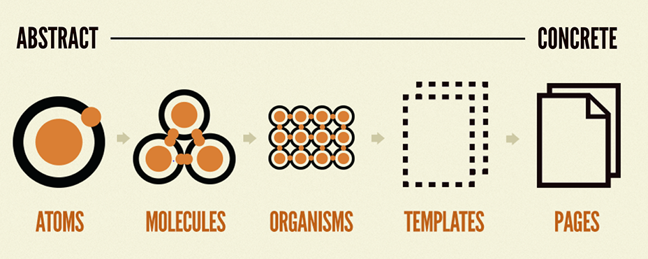

# cra-template-typescript

Opinionated Create React App template with typescript using Feature First Organization for [Create React App](https://github.com/nacasha/cra-template-typescript-feature).

To use this template, add `--template typescript-feature` when creating a new app.

For example:

```sh
npx create-react-app my-app --template typescript-feature

# or

yarn create react-app my-app --template typescript-feature
```

## TL;DR
```
── features/
   ├── app/
   │   ├── components
   │   ├── containers
   │   ├── pages
   │   └── router
   ├── user/
   │   ├── components/
   │   │   └── AutocompleteUser/
   │   │       ├── AutocompleteUser.tsx
   │   │       └── index.ts
   │   └── ...
   ├── post /
   │   ├── containers/
   │   │   └── PostForm/
   │   │       ├── PostForm.tsx
   │   │       └── index.ts
   │   ├── pages/
   │   │   ├── PostNewPage/
   │   │   │   ├── PostNewPage.tsx
   │   │   │   └── index.ts
   │   │   └── PostEditPage/
   │   │       ├── PostEditPage.tsx
   │   │       └── index.ts
   │   └── router/
   │       ├── PostFeatureRouter.tsx
   │       └── index.ts
   └── ...
```

## Main Idea
Main idea of this approach is modularize your folder of components, pages, hooks, etc. by their feature.
I follow the [Atomic Design Methodology](https://atomicdesign.bradfrost.com/chapter-2/) and articles about how structuring your project for large scale application. Each features usually have one or more folders that contains:
- components
- containers
- hooks
- pages
- redux
- router
- utils

## Explanation


Image above is the illustration of five stages atomic design, and these are the short version of explanation from the article.
- **Atoms** are UI elements that can’t be broken down any further and serve as the elemental building blocks of an interface.
- **Molecules** are collections of atoms that form relatively simple UI components.
- **Organisms** are relatively complex components that form discrete sections of an interface.
- **Templates** place components within a layout and demonstrate the design’s underlying content structure.
- **Pages** apply real content to templates and articulate variations to demonstrate the final UI and test the resilience of the design system.

Based on above explanation, I decided to divide into these folders. This division is **not based** on whether the component is stateful, stateless, make an API call, or contains business logic, it is more about how the component **represent an element**.

- **Components**  
  **Component that represent an element** (Input, Select, Button, Table).  
  Imagine you have a select component that fetch users data from the server (Autocomplete User) and it will be a reusable component, rather than implement API calls on every use, it will be easier to put those logic into component directly, so the component will only have basic props.

  ```js
  <AutocompleteUser value={...} onChange={...} />
  <AutocompleteArticle value={...} onChange={...} />
  <DiscountInput value={...} onChange={...} />
  ```

- **Containers**  
  **Component that represent more than one element** (Form, Layout, Navigation, TableWithPagination).  
  Form can be reusable component either, in this case we will take the example of PostForm. PostForm will be used in two cases, when user create new post and edit the post. Some business logic between pages remains the same (initial value, validation, notification) but the onSubmit handler might be different (create and update). We include the same business logic in the PostForm and extract different business logic into props. So when PostForm is used, we can create the handlers easily on each page.

  ```js
  // PostNewPage
  <PostForm onSubmit={...} />

  // PostEditPage
  <PostForm initialValues={...} onSubmit={...} />
  ```


- **Pages**  
  **Component that represent a page** (LoginPage, HomePage, PostNewPage, PostEditPage).  
  This component cannot be a reusable component and must only imported from Router component.

  ```js
  import PostNewPage from '../pages/PostNewPage';
  import PostEditPage from '../pages/PostEditPage';

  const PostFeatureRouter: React.FC = () => (
    <Switch>
      <Route path="/post/new" component={PostNewPage} exact />
      <Route path="/post/edit/:id" component={PostEditPage} exact />
    </Switch>
  );
  ```


## Features
- Typescript
- Feature First Organization
- Auto generate CSS Module definitions
- Popular ESLint rules to follow most best practices
- React Router and React Helmet Async
- Ready to use Redux setup configured using Redux Toolkit with support of persisting state
- VSCode debug configurations, workspace settings and recommended extensions

## Includes
- @reduxjs/toolkit
- connected-react-router
- history
- node-sass
- react-helmet-async
- react-redux
- react-router
- react-scripts
- redux-persist

## References
There are many references I read based on article for another frameworks, but the main idea is the same, modularization by feature.

- https://atomicdesign.bradfrost.com/chapter-2/
- https://www.robinwieruch.de/react-folder-structure
- https://engineering.kapost.com/2016/01/organizing-large-react-applications
- https://dev.to/maxpou/3-tips-for-scaling-large-vuejs-application-2edi
- https://mshossain.me/blog/structured-my-vue-project-for-scaling-large-vue-js-application
- https://www.freecodecamp.org/news/how-to-structure-your-project-and-manage-static-resources-in-react-native-6f4cfc947d92/
- https://yeti.co/blog/how-to-structure-your-react-redux-application/

For more information, please refer to:

- [Getting Started](https://create-react-app.dev/docs/getting-started) – How to create a new app.
- [User Guide](https://create-react-app.dev) – How to develop apps bootstrapped with Create React App.
